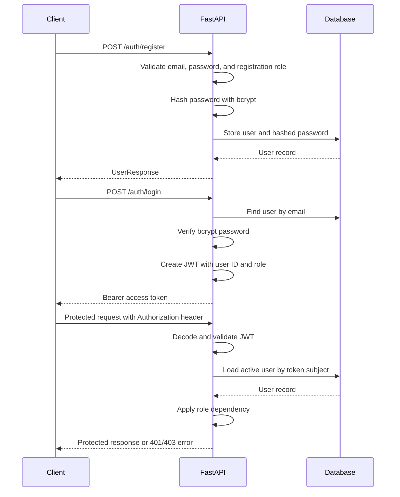

# Authentication and Authorization

## Authentication Flow

## Implemented Endpoints

- `POST /auth/register`: creates a customer or photographer account.
- `POST /auth/login`: verifies the password and returns a JWT access token.
- `GET /auth/me`: returns the authenticated user profile.

Public registration does not accept `ADMINISTRATOR`. Administrator accounts are provisioned separately and can use administrator-protected endpoints.

## Token Details

- Passwords are hashed with bcrypt before storage.
- The JWT contains the user ID in `sub` and the role in `role`.
- The JWT algorithm, secret, and expiration are loaded from environment variables.
- Clients send the token as `Authorization: Bearer <token>`.
- The backend loads the user from the database and checks that the user is active.
- Missing or invalid credentials return `401 Unauthorized`.
- A valid user with the wrong role returns `403 Forbidden`.

## Roles and Current Access

### CUSTOMER

- Can access `/auth/me`.
- Can browse published photos and available products.
- Can access their own cart.
- Can create and view their own orders.
- Can cancel their own cancellable orders.
- Cannot manage photographer profiles, photos, or products.
- Cannot update order statuses.

### PHOTOGRAPHER

- Can access `/auth/me`.
- Can create, view, and update their own photographer profile.
- Can create, view, update, and delete their own photos.
- Can create, view, update, and delete products belonging to their own photos.
- Can view order items related to their own products.
- Cannot access customer-only cart or customer order endpoints.

### ADMINISTRATOR

- Can access `/auth/me`.
- Can update valid order status transitions through `PATCH /orders/{order_id}/status`.
- No administrator user-management API is currently implemented.
- Administrator access does not imply access to customer carts or customer order listings.
