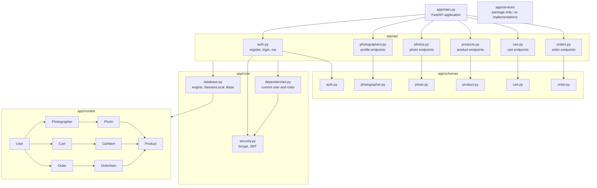

# Class and Module Diagram

This diagram describes the modules and classes currently implemented in the backend. The service package exists but contains no service implementations.

## Module Responsibilities

- `app/main.py` creates the FastAPI application and registers all routers.
- `app/api/` contains the implemented route handlers and current business logic.
- `app/schemas/` contains Pydantic request and response models.
- `app/core/database.py` loads `DATABASE_URL`, creates the SQLAlchemy engine/session factory, and defines `Base`.
- `app/core/security.py` hashes passwords with bcrypt and creates/decodes JWTs.
- `app/core/dependencies.py` loads the authenticated user and provides customer, photographer, and administrator role dependencies.
- `app/models/` contains the eight SQLAlchemy models.
- `app/services/` currently contains only `__init__.py`; no service layer is claimed in this diagram.
