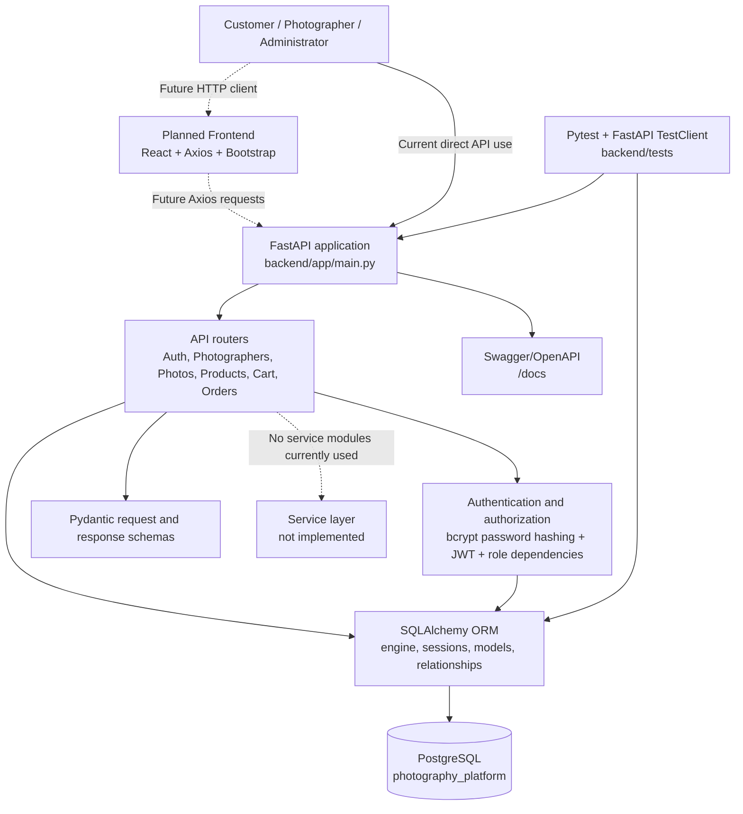

# System Architecture

## Implementation Status

This document describes the backend that currently exists in the repository. The React frontend is planned but is not implemented yet. The backend service package exists as a folder, but it does not contain service implementations; business behavior is currently implemented in the API modules and core dependencies.

## Architecture Overview



## Current Components

### FastAPI Application

- Entry point: `backend/app/main.py`
- Creates the FastAPI application.
- Registers these routers:
  - `backend/app/api/auth.py`
  - `backend/app/api/photographers.py`
  - `backend/app/api/photos.py`
  - `backend/app/api/products.py`
  - `backend/app/api/cart.py`
  - `backend/app/api/orders.py`
- Provides the health endpoint `GET /`.
- Provides automatic Swagger/OpenAPI documentation at `/docs`.

### Authentication and Authorization

- Password hashing and JWT functions: `backend/app/core/security.py`.
- Database session and current-user dependencies: `backend/app/core/dependencies.py`.
- JWT access tokens contain the user ID and role.
- The backend loads the JWT secret and token settings from `backend/.env`.
- Role dependencies currently support:
  - `CUSTOMER`
  - `PHOTOGRAPHER`
  - `ADMINISTRATOR`

Public registration creates customer or photographer accounts. Administrator access is intended for provisioned administrator users; public registration does not accept the administrator role.

### Schemas

Pydantic request and response schemas are stored in `backend/app/schemas/`:

- `auth.py`: registration, login, token, and user responses.
- `photographer.py`: photographer profile requests and responses.
- `photo.py`: photo create/update/response schemas.
- `product.py`: product create/update/response schemas.
- `cart.py`: cart item requests and cart totals/responses.
- `order.py`: order, order item, photographer order, and status responses.

### Database Layer

- Database engine, session factory, and declarative base: `backend/app/core/database.py`.
- PostgreSQL database configured by `DATABASE_URL`.
- ORM models are stored in `backend/app/models/`.
- The current physical database is `photography_platform`.

The `backend/app/services/` directory currently contains only its package initializer. No service-layer classes or functions are currently implemented.

## Database Tables and Relationships

The implemented tables are:

- `users`
- `photographers`
- `photos`
- `products`
- `carts`
- `cart_items`
- `orders`
- `order_items`

```mermaid
erDiagram
    USERS ||--o| PHOTOGRAPHERS : has
    USERS ||--o| CARTS : owns
    USERS ||--o{ ORDERS : places
    PHOTOGRAPHERS ||--o{ PHOTOS : creates
    PHOTOS ||--o{ PRODUCTS : offers
    CARTS ||--o{ CART_ITEMS : contains
    PRODUCTS ||--o{ CART_ITEMS : selected_in
    ORDERS ||--o{ ORDER_ITEMS : contains
    PRODUCTS ||--o{ ORDER_ITEMS : purchased_as

    USERS {
        int id PK
        string email UK
        string hashed_password
        enum role
        boolean is_active
    }
    PHOTOGRAPHERS {
        int id PK
        int user_id FK UK
        string display_name
        string bio
    }
    PHOTOS {
        int id PK
        int photographer_id FK
        string title
        string image_url
        enum status
    }
    PRODUCTS {
        int id PK
        int photo_id FK
        string name
        string size
        string material
        decimal price
        int stock
        enum status
    }
    CARTS {
        int id PK
        int user_id FK UK
    }
    CART_ITEMS {
        int id PK
        int cart_id FK
        int product_id FK
        int quantity
    }
    ORDERS {
        int id PK
        int customer_id FK
        enum status
        decimal total_amount
    }
    ORDER_ITEMS {
        int id PK
        int order_id FK
        int product_id FK
        int quantity
        decimal unit_price
    }
```

`ORDER_ITEMS.unit_price` preserves the price at the time of purchase. Product prices can therefore change without changing historical order totals.

## API Areas and Flows

### Authentication Flow

1. A customer or photographer submits registration data to `POST /auth/register`.
2. The password is hashed with bcrypt before storage.
3. The user submits credentials to `POST /auth/login`.
4. The backend verifies the password and returns a JWT access token.
5. Protected requests send the token in the `Authorization: Bearer <token>` header.
6. `get_current_user` validates the token and loads the user from the database.
7. Role dependencies enforce customer, photographer, or administrator access.

### Customer Flow

1. Authenticate with `/auth/login`.
2. Browse published photos with `GET /photos`.
3. Browse available products with `GET /products`.
4. Add available products to the customer cart with `POST /cart/items`.
5. View or update the customer cart.
6. Place an order with `POST /orders`.
7. View only the customer’s own orders.
8. Cancel an order when its status allows cancellation.

### Photographer Flow

1. Register or authenticate as a photographer.
2. Create and manage the own profile at `/photographers/profile`.
3. Create, list, update, publish, and delete own photos.
4. Create and manage products belonging to own photos.
5. View only order items related to the photographer’s own products.

### Administrator Flow

Administrators are supported by the role dependency and order status endpoint. An administrator can update valid order status transitions through `PATCH /orders/{order_id}/status`. There are no separate administrator user-management APIs currently implemented.

### Cart Flow

- A customer cart is created when the customer first requests it or adds an item.
- A cart belongs to exactly one user.
- A repeated product add increases the existing cart item quantity.
- The backend checks product availability, published-photo status, and current stock.
- Subtotals and total amounts are calculated from database product prices.

### Order Flow

- Order creation validates every cart item before changing stock or clearing the cart.
- The backend reads current product prices and stores them in order items.
- Stock is reduced only after validation succeeds.
- The cart is cleared after order items are created successfully.
- Customer cancellation restores the purchased quantities to product stock.
- Administrator status transitions follow the rules implemented in `backend/app/api/orders.py`.

## Current API Surface

### Authentication

| Method | Path | Access |
|---|---|---|
| POST | `/auth/register` | Public customer/photographer registration |
| POST | `/auth/login` | Public |
| GET | `/auth/me` | Authenticated user |

### Photographer Profiles

| Method | Path | Access |
|---|---|---|
| POST | `/photographers/profile` | Photographer |
| GET | `/photographers/profile` | Photographer |
| PUT | `/photographers/profile` | Photographer |

### Photos

| Method | Path | Access |
|---|---|---|
| POST | `/photos` | Photographer |
| GET | `/photos/mine` | Photographer |
| GET | `/photos` | Customer; published photos only |
| GET | `/photos/{photo_id}` | Customer; published photos only |
| PUT | `/photos/{photo_id}` | Owning photographer |
| DELETE | `/photos/{photo_id}` | Owning photographer |

### Products

| Method | Path | Access |
|---|---|---|
| POST | `/products` | Photographer; own photo only |
| GET | `/products/mine` | Photographer |
| GET | `/products` | Customer; available products only |
| GET | `/products/{product_id}` | Customer; available products only |
| PUT | `/products/{product_id}` | Owning photographer |
| DELETE | `/products/{product_id}` | Owning photographer |

### Cart

| Method | Path | Access |
|---|---|---|
| GET | `/cart` | Customer |
| GET | `/cart/items` | Customer |
| POST | `/cart/items` | Customer |
| PUT | `/cart/items/{item_id}` | Customer; own cart item only |
| DELETE | `/cart/items/{item_id}` | Customer; own cart item only |

### Orders

| Method | Path | Access |
|---|---|---|
| POST | `/orders` | Customer |
| GET | `/orders` | Customer; own orders only |
| GET | `/orders/{order_id}` | Customer; own order only |
| GET | `/orders/photographer` | Photographer; related products only |
| POST | `/orders/{order_id}/cancel` | Customer; own cancellable order only |
| PATCH | `/orders/{order_id}/status` | Administrator |

## Testing Architecture

Tests are stored in `backend/tests/` and use pytest with FastAPI `TestClient`. Feature tests use isolated in-memory SQLite databases and dependency overrides, so they do not reset or destroy the development PostgreSQL database.

Current test modules:

- `test_health.py`
- `test_auth.py`
- `test_models.py`
- `test_database_schema.py`
- `test_photographer_photo_product.py`
- `test_cart.py`
- `test_orders.py`

The latest complete backend result is 41 passing tests, with one existing third-party deprecation warning from the TestClient dependency.

## Planned Components Not Implemented

The following are intentionally outside the current implementation described here:

- React frontend
- Axios frontend integration
- Bootstrap UI
- Payment processing
- AI enhancement
- Deployment configuration
- GitHub Actions CI/CD
- Dedicated service-layer modules
