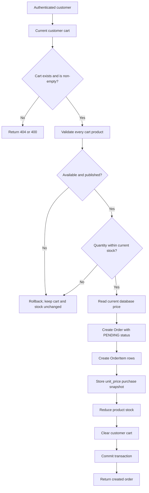

# Order Flow

## Create Order



The implementation validates all cart items before changing product stock, creating order items, or deleting cart items. SQLAlchemy rollback is used when validation or database errors occur.

## Order Response

Customer order responses include:

- Order ID
- Customer ID
- Status
- Total amount
- Creation and update timestamps
- Product ID and name for each item
- Quantity
- Purchase-time unit price
- Item subtotal

Photographer order responses include only items belonging to that photographer's products and a related total. Customer-sensitive details are not included in that response.

## Customer Order Access

- `POST /orders` creates an order from the authenticated customer's cart.
- `GET /orders` lists only the authenticated customer's orders.
- `GET /orders/{order_id}` returns only an order owned by the authenticated customer.
- A customer cannot read another customer's order; the API returns `404`.

## Photographer Order Access

- `GET /orders/photographer` returns orders containing products belonging to the authenticated photographer.
- Only the photographer's related order items are returned.
- Unrelated products from the same order are not included in the photographer response.

## Cancellation Flow

```mermaid
flowchart TD
    Customer[Customer] --> Request[POST /orders/{order_id}/cancel]
    Request --> Own[Verify order belongs to customer]
    Own --> Allowed{Cancellation allowed?}
    Allowed -- No --> Invalid[Return 400]
    Allowed -- Yes --> Restore[Restore product stock]
    Restore --> Cancel[Set status to CANCELLED]
    Cancel --> Commit[Commit transaction]
    Commit --> Result[Return cancelled order]
```

Orders can be cancelled from `PENDING` or `CONFIRMED`. Repeated cancellation and cancellation after later processing stages are rejected.

## Statuses and Transitions

The current `OrderStatus` enum contains:

- `PENDING`
- `CONFIRMED`
- `PROCESSING`
- `SHIPPED`
- `DELIVERED`
- `COMPLETED`
- `CANCELLED`

Implemented status transitions:

- `PENDING` -> `CONFIRMED` or `CANCELLED`
- `CONFIRMED` -> `PROCESSING` or `CANCELLED`
- `PROCESSING` -> `COMPLETED`
- `SHIPPED` -> `DELIVERED`
- `DELIVERED` -> `COMPLETED`
- `COMPLETED` -> no further status
- `CANCELLED` -> no further status

Administrator status updates use `PATCH /orders/{order_id}/status`. Customer cancellation uses the dedicated cancellation endpoint.
